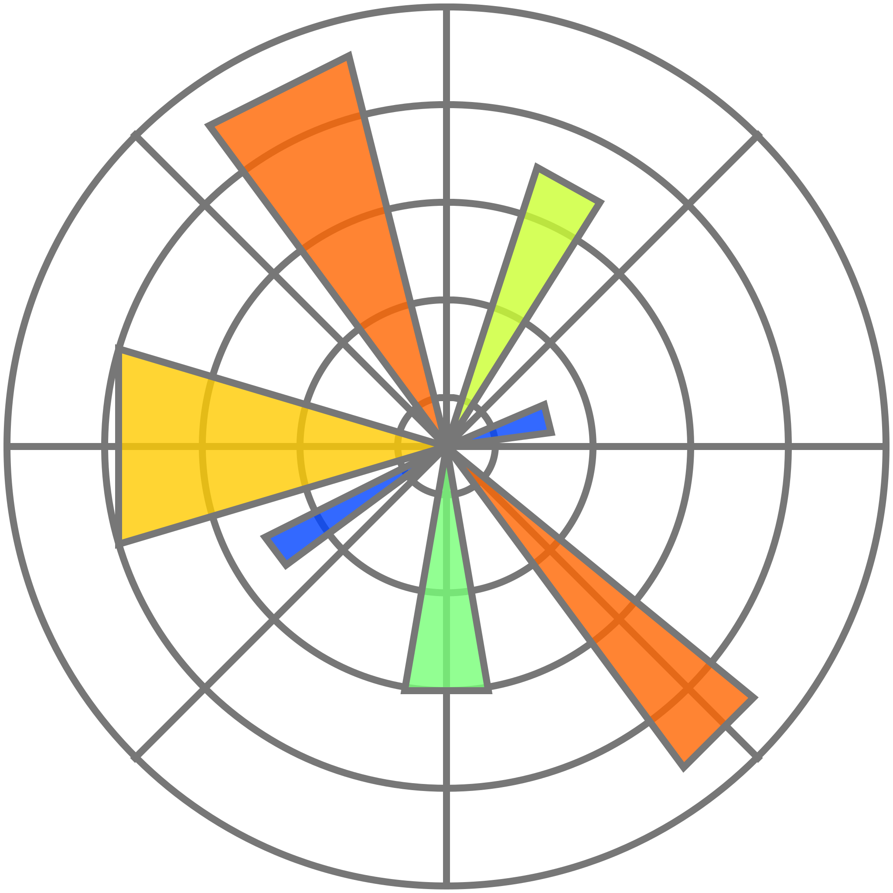

# Way too formal crap

As a former Ads Quality Specialist and QA SME for Data Driven Policy Management at TikTok, I have extensive experience in analyzing advertising data and driving revenue growth. In these roles, I collaborated with multiple teams, including Ads Policy, Product, Engineering, and Ads Quality, to create and present reports that informed decision-making and improved processes.

Recently, I pursued a master's degree in Data Science at Assembler Institute of Technology, where I learned Python, SQL, and other technologies. Throughout my coursework, I gained hands-on experience in real-world projects, totaling over 1000 hours, where I applied machine learning and statistical techniques to solve complex problems.

As a data scientist, I am passionate about leveraging data to drive strategic business decisions and insights. I have the skills and experience to conduct in-depth analyses and extract meaningful insights from data, as well as present findings to stakeholders. I am eager to apply my expertise and passion to a new role in the data science field.

Let's connect and see how I can contribute to your team's success.

    

Python

    

R
    

SQL
    

mongoDB
    

R
    

pandas
    

numpy
 

matplotlib
    

seaborn
    

    
    
    
    
    
     
    
    
    
    
    
     
    
    
    
    
    

# Hey, I'm Rubén!
***

I am a 📊data lover currently pursuing a master's degree in data science at  <a href="https://assemblerinstitute.com/">Assembler Institute of Technology</a>

# A bit more about me

# 📫 Reach out to me
***

<!--
**yourssincerely/yourssincerely** is a ✨ _special_ ✨ repository because its `README.md` (this file) appears on your GitHub profile.

Here are some ideas to get you started:

- 🔭 I’m currently working on ...
- 🌱 I’m currently learning ...
- 👯 I’m looking to collaborate on ...
- 🤔 I’m looking for help with ...
- 💬 Ask me about ...
- 📫 How to reach me: ...
- 😄 Pronouns: ...
- ⚡ Fun fact: ...
-->

 

