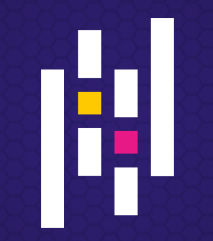
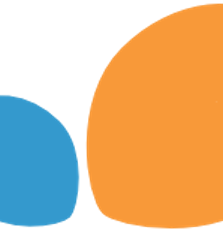

# Hey, I'm Rubén!

I am a 📊data lover currently pursuing a master's degree in data science at  <a href="https://assemblerinstitute.com/">Assembler Institute of Technology</a>

## Tech stack

    

    
    Anaconda

    
    Jupyter

    
    SQL

    
    mongoDB

    
    neo4j

    
    Python

    
    pandas

    
    Matplotlib

    
    seaborn

    
    NumPy

    
    SciPy

    
    scikit-learn

    

    
    PyTorch

    

    
    TensorFlow
  
    

    
    R

      

    
    Power BI

    

    Excel

## A bit more about me

I'm originally from Spain :spain: but I'm currently living in Ireland :ireland:. It's been a good opportunity to step out of my comfort zone and try something new. Here are some of the things I enjoy in my spare time:

* :deciduous_tree: Hiking is my favorite way to disconnect from the world and reconnect with nature. There's something about being out in the woods that just feels right to me.

* :ant:	I'll cue up any nature documentary to escape into the wonders of the natural world. As weird as it sounds, I'm a bit of an ant nerd. I find their social structure and behavior absolutely captivating.

* :swimmer: I love jumping in the pool and swimming laps whenever I get the chance.

* :chess_pawn: I'm a total noob when it comes to chess, but that doesn't stop me from enjoying the game.

* :jigsaw: Puzzles aren't really my thing, but I'll admit, every once in a blue moon I'll give one a shot just to see if I can do it.

## Github stats

Although I have a lot to learn, I thought it would be fun to share my GitHub stats on my ReadMe as a way to track my progress and keep myself motivated.

* These are the languages that I use!

* These are my general stats!

* These are (this is rather) my baby projects. They're not anything special, but I'm still  proud of them.

# 📫 Reach out to me

